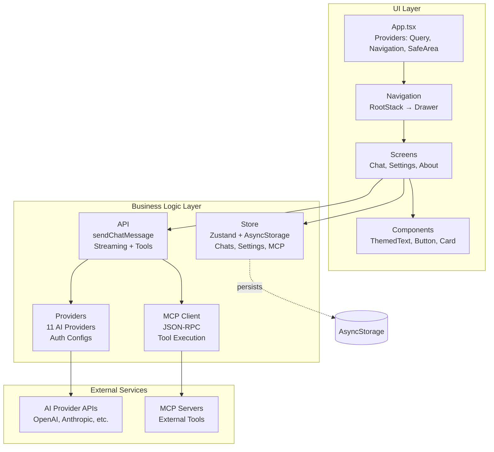
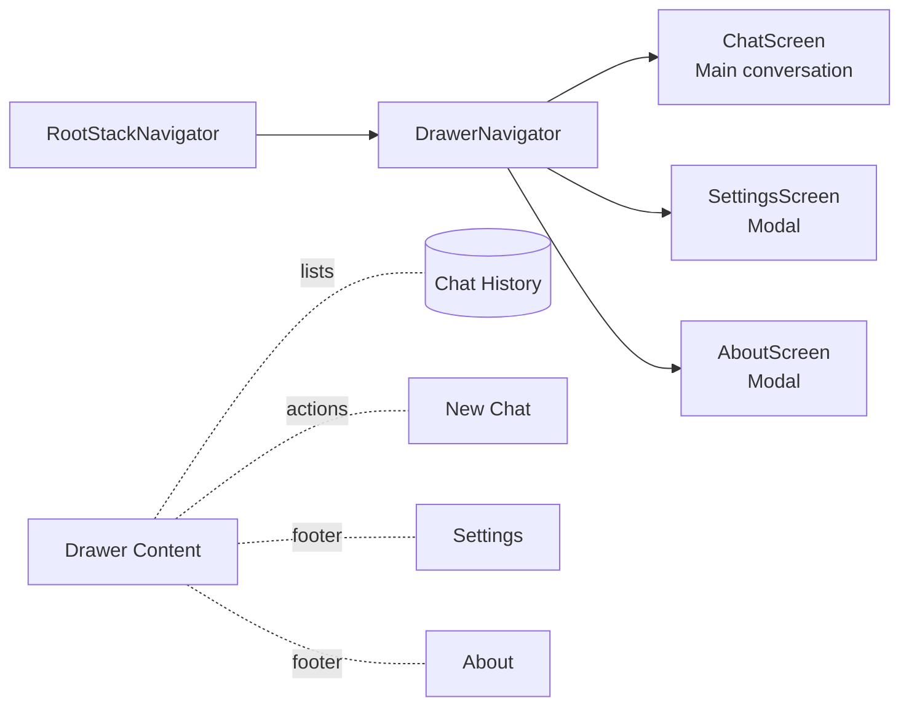
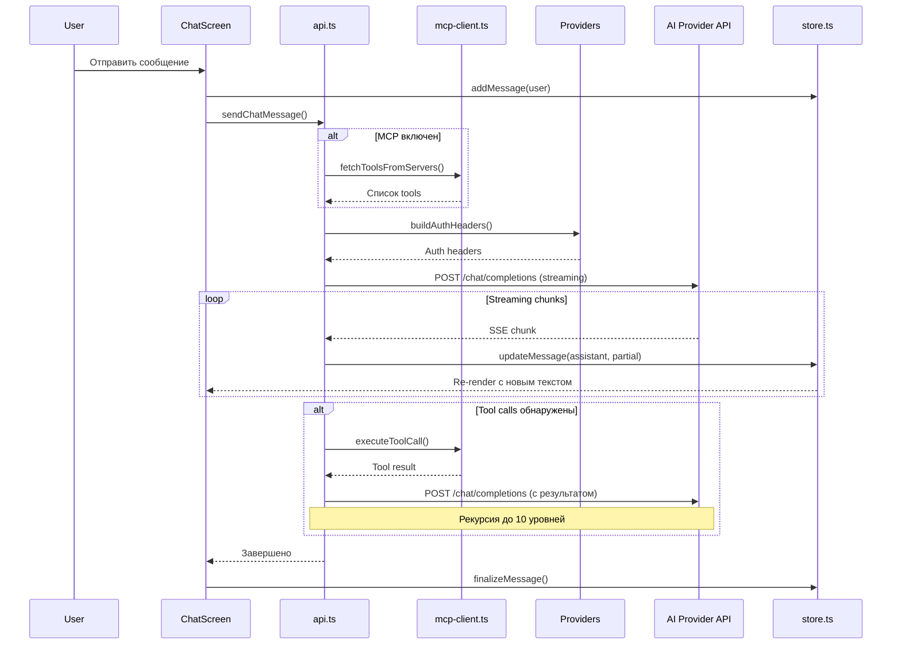
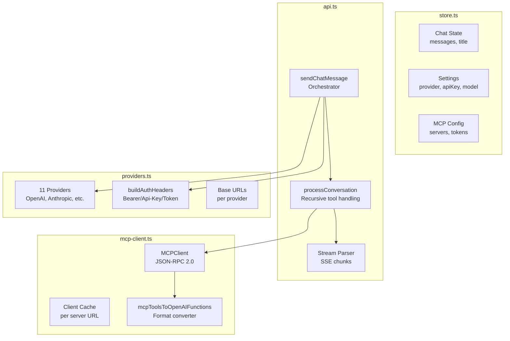

# Иишница

[](https://github.com/pastukhov/iishnitsa/actions/workflows/pr-checks.yml)
[](https://codecov.io/gh/pastukhov/iishnitsa)
[](https://github.com/pastukhov/iishnitsa/releases/download/apk-latest/iishnitsa.apk)

Иишница — приложение с клиентом на Expo/React Native. Проект рассчитан на локальную разработку и сборку под разные окружения.

## Возможности

- Единый интерфейс чата с поддержкой множества AI-провайдеров (OpenAI, Anthropic, Together, Mistral, Perplexity, DeepSeek, Groq, Yandex и др.)
- Поддержка MCP-инструментов (Model Context Protocol) через конфиг в приложении
- Прикрепление изображений к сообщениям
- Тёмная и светлая темы
- Персистентное хранение чатов и настроек

## Промпты

Коллекция промптов для выбора при старте чата синхронизируется из репозитория
[awesome-ai-prompts](https://github.com/0x2e-Tech/awesome-ai-prompts) и
генерируется скриптом `npm run sync:prompts`. Данные сохраняются в
`client/lib/prompts-data.ts` и используются через `client/lib/prompts.ts`.

## Архитектура приложения

### Общая структура



### Навигация



### Data Flow: Отправка сообщения



### Ключевые модули



## Структура проекта

- `client/` — мобильный клиент на Expo
  - `App.tsx` — точка входа с провайдерами (React Query, Navigation, SafeArea)
  - `lib/` — бизнес-логика (store, api, providers, mcp-client)
  - `screens/` — экраны приложения (Chat, Settings, About)
  - `navigation/` — настройка навигации (drawer)
  - `components/` — переиспользуемые UI-компоненты
  - `hooks/` — кастомные хуки (useTheme, useColorScheme)
  - `constants/` — константы (theme, releaseNotes)
- `scripts/` — вспомогательные скрипты сборки
- `assets/` — статические ресурсы

## Быстрый старт

1. Установите зависимости:

```bash
npm install
```

2. Запустите нужный режим:

```bash
npm run expo:dev
```

## Основные команды

```bash
# Разработка
npm run expo:dev              # Запуск Expo dev-сервера

# Качество кода
npm run lint                  # ESLint проверка
npm run lint:fix              # ESLint с автоисправлением
npm run check:types           # Проверка типов TypeScript
npm run check:format          # Проверка форматирования Prettier
npm run format                # Автоформатирование кода

# Тестирование
npm test                      # Запуск Jest тестов
npm run test:watch            # Тесты в watch-режиме
npm run test:coverage         # Тесты с отчётом покрытия

# Проверка провайдеров
npm run check:providers       # Тест подключения к AI-провайдерам
npm run check:providers:mock  # Тест с моками (для CI)

# Промпты
npm run sync:prompts          # Синхронизация списка промптов

# Сборка
npm run expo:static:build     # Сборка статического бандла
```

## Настройка

- Параметры API и MCP задаются в разделе Settings внутри приложения.
- Секреты храните в окружении и не коммитьте в репозиторий.

## CI/CD

### Flow

```
┌─────────────┐     ┌─────────────┐     ┌─────────────┐     ┌─────────────┐
│   Feature   │     │  PR Checks  │     │   Release   │     │  Build APK  │
│   Branch    │────▶│             │────▶│             │────▶│             │
└─────────────┘     └─────────────┘     └─────────────┘     └─────────────┘
      │                   │                   │                   │
   push              pull_request         PR merged          workflow_dispatch
      │                   │                   │                   │
      ▼                   ▼                   ▼                   ▼
  Auto PR            lint, types,        create tag          Gradle build
                     tests, format        vX.Y.Z              + release
```

### Workflows

| Workflow                   | Триггер                          | Назначение                                      |
| -------------------------- | -------------------------------- | ----------------------------------------------- |
| **PR Checks**              | `pull_request` to main           | Lint, typecheck, format, tests, commitlint      |
| **Release**                | `push` to main / merged PR       | Вычисляет версию, создаёт тег, запускает сборку |
| **Build APK**              | triggered by Release             | Собирает APK через Gradle, публикует релиз      |
| **Auto PR**                | `push` to branch                 | Автоматически создаёт PR                        |
| **Delete Merged Branches** | PR merged                        | Удаляет ветку после merge                       |

### Секреты

| Секрет          | Назначение                  |
| --------------- | --------------------------- |
| `CODECOV_TOKEN` | Токен для загрузки coverage |

### Версионирование

Версии вычисляются автоматически по [Conventional Commits](https://www.conventionalcommits.org/):

- `feat:` → minor bump (1.0.0 → 1.1.0)
- `fix:` → patch bump (1.0.0 → 1.0.1)
- `feat!:` или `BREAKING CHANGE:` → major bump (1.0.0 → 2.0.0)

## Вклад

- Держите изменения небольшими и локальными.
- Перед PR укажите назначение, описание изменений и шаги проверки.
- Избегайте коммита артефактов сборки (`dist/`).

## Лицензия

Если нужна лицензия, добавьте файл `LICENSE` и укажите её тип.
